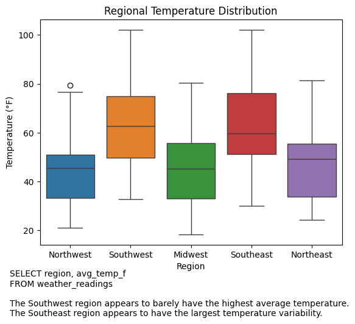
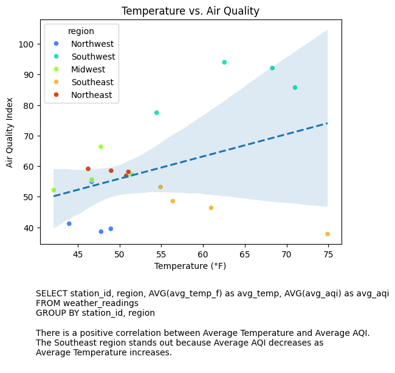
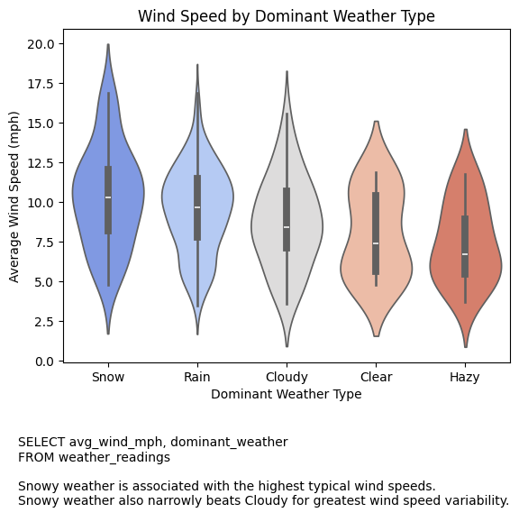

# Weather Station Analysis

AICC 170 · Introduction to Data Mining and Analytics · Spring 2026 (course final)

SQL-driven exploration of 18 months of monthly weather summaries from 20 stations across five U.S. regions. Every chart is fed by a hand-written query against a MariaDB table — no query code was provided — and the chart type for each question was chosen to satisfy stated requirements (e.g., "central tendency and spread must both be visible" → box plot, "outliers must be visible" → violin plot).

## Workflow

1. Loaded `weather_readings.csv` (360 rows, 17 columns) into MariaDB via DBeaver and verified the row count.
2. Connected from Python with SQLAlchemy + PyMySQL.
3. For each of seven questions: wrote the SQL, pulled results into pandas, plotted with seaborn, wrote a two-sentence interpretation.

## Questions and findings

| # | Question | SQL features | Chart | Finding |
|---|---|---|---|---|
| 1 | Temperature distribution by region | raw rows | box plot | Southwest highest average; Southeast widest spread |
| 2 | Precipitation by season | `AVG`, `GROUP BY`, manual season order | bar | Spring wettest by ~1 in over the driest season |
| 3 | Temperature vs. AQI by station | `AVG` ×2, `GROUP BY` two columns | scatter + regression line, hue by region | Positive correlation overall; Southeast runs against it |
| 4 | Wind speed by dominant weather | raw rows | violin | Snow has the highest typical wind and the widest variability |
| 5 | Monthly humidity cycle | `GROUP BY month`, `ORDER BY` | line, relabeled x-axis | Peaks in November and February — not the summer peak I expected |
| 6 | High-AQI events by region | `WHERE`, `GROUP BY`, `HAVING`, `ORDER BY … DESC` | bar | Southwest ~44 events; consistent with wildfire season in an arid region |
| 7 | Precipitation vs. visibility by station | `SUM` + `AVG`, `GROUP BY` | scatter + regression line | Strong negative correlation; Southeast stations are the extreme end |

Plots are in `plots/`; the SQL for each chart is printed beneath it.





## Run it

The notebook connects to MariaDB if `MARIADB_USER`, `MARIADB_PASSWORD`, `MARIADB_HOST`, `MARIADB_PORT`, and `MARIADB_DB` are set. Otherwise it builds a local SQLite database from the CSV, so it runs with no setup:

```
pip install -r ../../requirements.txt
jupyter notebook weather_analysis.ipynb
```

The SQL is standard enough that both backends produce identical results.

## Stack

Python · pandas · seaborn · matplotlib · SQLAlchemy · MariaDB (DBeaver) · SQLite fallback
