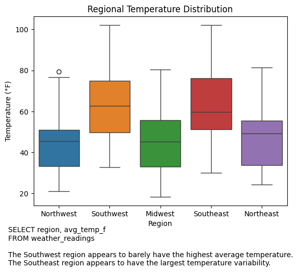
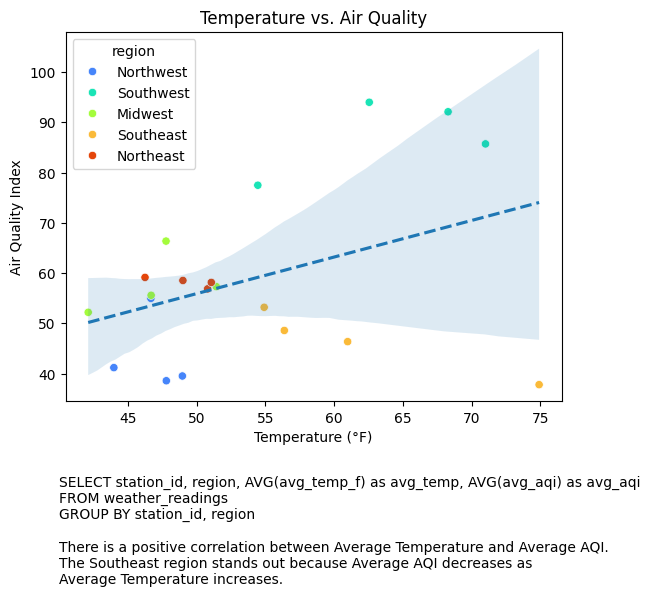
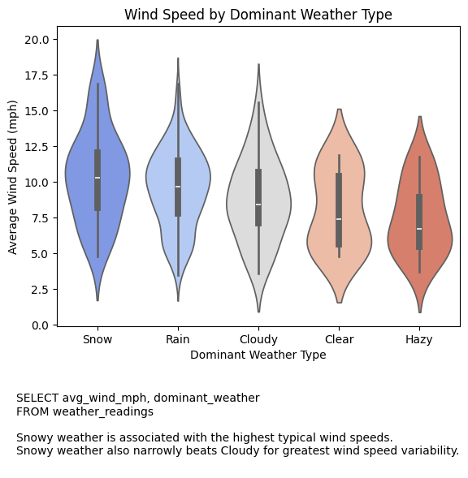

# Weather Station Analysis

AICC 170, Introduction to Data Mining and Analytics, Spring 2026 (course final)

The dataset has 18 months of monthly weather summaries from 20 stations across five U.S. regions. For our final, I answered seven questions about it. Each answer is a SQL query I wrote against a MariaDB table and a chart. The assignment set rules for some charts, like "central tendency and spread must both be visible," so I picked chart types to match. For example, that one became a box plot, and "outliers must be visible" became a violin plot.

## Workflow

1. Loaded `weather_readings.csv` (360 rows, 17 columns) into MariaDB with DBeaver and checked the row count.
2. Connected from Python with SQLAlchemy and PyMySQL.
3. For each question I wrote the SQL, pulled the results into pandas, plotted them with seaborn, and wrote a two-sentence interpretation.

## Questions and findings

| # | Question | SQL used | Chart | What I found |
|---|---|---|---|---|
| 1 | Temperature distribution by region | raw rows | box plot | Southwest has the highest average; Southeast has the widest spread |
| 2 | Precipitation by season | `AVG`, `GROUP BY`, manual season order | bar | Spring is the wettest, about 1 in more than the driest season |
| 3 | Temperature vs. AQI by station | two `AVG`s, `GROUP BY` on two columns | scatter with regression line, colored by region | Positive correlation overall, but the Southeast goes the other way |
| 4 | Wind speed by dominant weather | raw rows | violin | Snow has the highest typical wind speed and the most variation |
| 5 | Monthly humidity cycle | `GROUP BY month`, `ORDER BY` | line, relabeled x-axis | Peaks in November and February. I expected a summer peak |
| 6 | High-AQI events by region | `WHERE`, `GROUP BY`, `HAVING`, `ORDER BY … DESC` | bar | Southwest has about 44 events, which fits wildfire season in a dry region |
| 7 | Precipitation vs. visibility by station | `SUM` and `AVG`, `GROUP BY` | scatter with regression line | Strong negative correlation; Southeast stations sit at the far end |

All seven charts are in `plots/`. In the notebook, each chart has its SQL printed under it.





## Run it

If `MARIADB_USER`, `MARIADB_PASSWORD`, `MARIADB_HOST`, `MARIADB_PORT`, and `MARIADB_DB` are set, the notebook connects to MariaDB. If they aren't, it builds a local SQLite database from the CSV, so it runs with no setup:

```
pip install -r ../../requirements.txt
jupyter notebook weather_analysis.ipynb
```

The queries are plain enough SQL that both databases give the same results.

## Stack

Python, pandas, seaborn, matplotlib, SQLAlchemy, MariaDB (through DBeaver)
