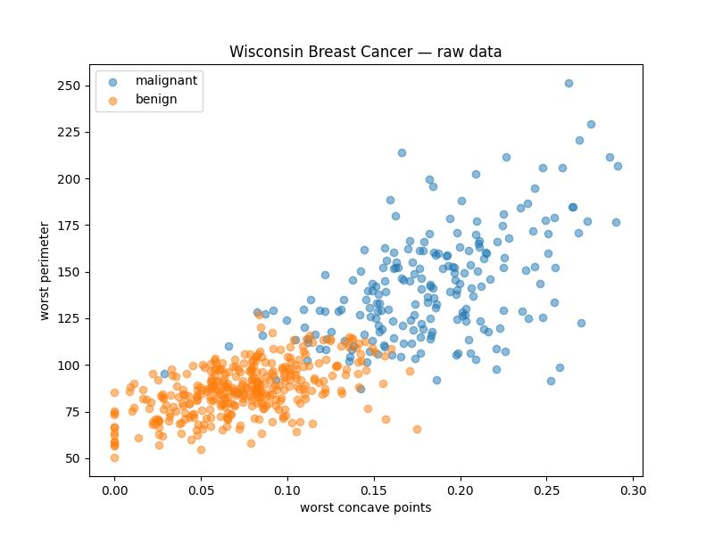
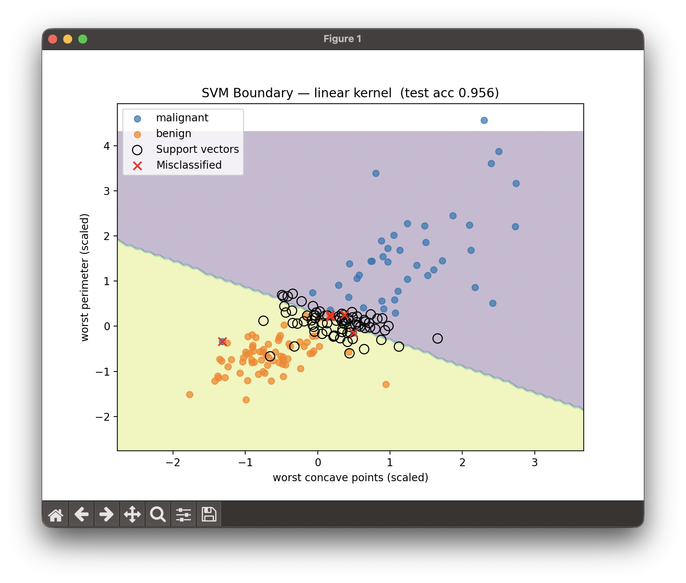
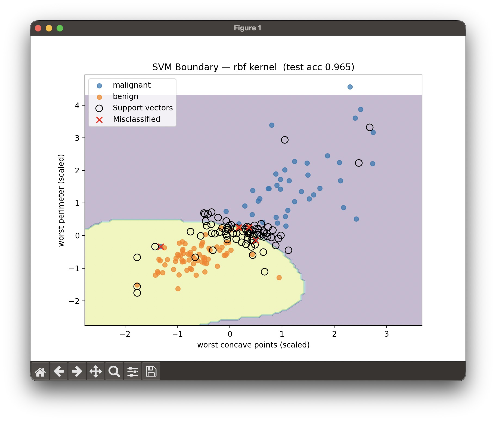
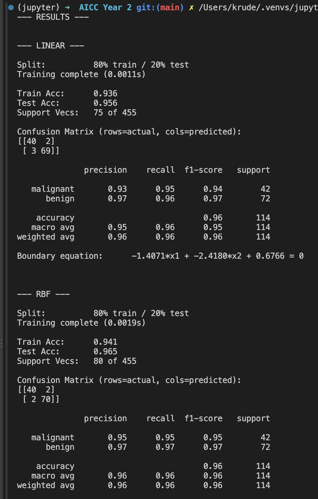

# SVM — Wisconsin Breast Cancer

AICC 210 · Machine Learning · Fall 2026

Classifies tumors as malignant or benign with a support vector machine, comparing a linear kernel against an RBF kernel on the same features and split.

## Approach

1. **Feature selection** — of the 30 features in the scikit-learn Wisconsin dataset, `worst concave points` and `worst perimeter` have the highest absolute correlation with the target. Using just those two keeps the model plottable in 2D.
2. **Split and scale** — stratified 80/20 train/test split; `StandardScaler` fit on the training set only, then applied to the test set.
3. **Train** — `SVC` with `kernel='linear'`, then again with `kernel='rbf'`.
4. **Evaluate** — accuracy, confusion matrix, classification report, and a `DecisionBoundaryDisplay` plot for each kernel.

## Results

| Kernel | Test accuracy | Recall (malignant) |
|---|---|---|
| Linear | 95.6% | 0.95 |
| RBF | 96.5% | 0.95 |

Recall on the malignant class is the number that matters here — a false negative is a missed tumor. Both kernels hit 0.95; RBF picks up one more point of overall accuracy by curving the boundary through the overlap region.

## Plots

Raw data, colored by class:



Linear kernel decision boundary:



RBF kernel decision boundary:



Terminal output:



## Run

```
pip install -r ../../requirements.txt
python "SVM Lab (Wisconsin Breast Cancer).py"
```

Dataset loads from `sklearn.datasets.load_breast_cancer()` — no download needed.
